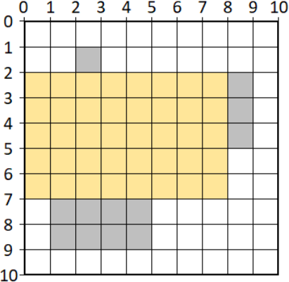

# Legnagyobb szabad hely  
  
Egy `W` x `H` méretű téglalap alakú területen van `K` darab téglalap. Ismerjük a téglalapok helyét és méretét. A téglalapok nem  fedik le teljesen a területet.  
Keresd meg azt a legnagyobb területű, téglalap alakú helyet, amit még le lehet tenni a területre úgy, hogy ne legyen átfedésben más téglalapokkal. Mekkora ez a terület?  
  
## Bemenet:  
- Az első sor tartalma három egész szám: `W H K`, ahol `W` a teljes tereület szélessége, `H` a magassága, és `1 <= W`, `H <= 10^4`, `0 < K <= 10^2` teljesül.  
A következő `K` sor mindegyike 4 egész számot tartalmaz: `Xi Yi Wi Hi` (1 <= i <= K) , ahol (`Xi`, `Yi` az i-dik téglalap bal felső csúcsának koordinátája, `Wi` a téglalap szélessége, `Hi` a magassága.  
  
## Kimenet:  
A legnagyobb szabadon maradt téglalap alakú terület mérete. (területe)  
  
## Példa:  
Bemenet:  
```
10 10 3  
2 1 1 1  
1 7 4 2  
8 2 1 3  
```  
Kimenet:  
40  
  
Magyarázat:  
  
