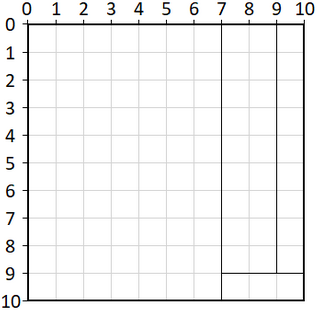

# Napelem darabolás  
  
Adott egy `W` x `H` méretű, téglalap alakú napelem, melyet `K` darab vágással feldarabolunk kisebb elemekre. Egy vágás mindig pontosan egy elemet választ szét két kisebb téglalap alakú elemre. Ismerve a vágásokat (nem feltétlenül sorrendben), számoljuk ki a keletkezett K + 1 darab elem területének szórását!  
  
## Bemenet:  
Első sor tartalma három egész szám:  
`W H K`  
melyekre 1 <= W, H, K <= 10^4 teljesül.  
A következő `K` darab sor mindegyike négy egész számot tartalmaz:  
`Xi Yi Pi Qi` (1 <= i <= K)  
ahol (Xi, Yi) és (Pi, Qi) az i-edik vágás végpontjainak a koordinátái (a vágások nem feltétlenül a feldarabolás sorrendjében vannak megadva).  
  
## Kimenet:  
A keletkezett elemek területének szórása (2 tizedesjegyre kerekítve).  
  
## Példa:  
Bemenet:  
```  
10 10 3  
9 0 9 9  
7 9 10 9  
7 0 7 10  
```   
Kimenet:  
`26.52`  
  
## Magyarázat:  
  
  
Területeik: 70, 18, 9 és 3  
A szórásuk: 26.524, ami 2 tizedesre kerekítve **26.52**  
