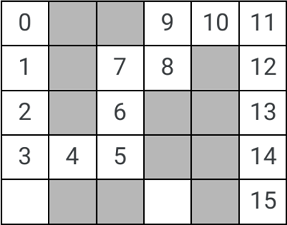
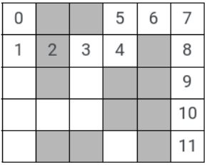
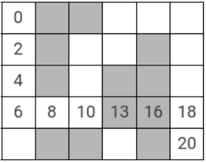

# Wall Demolisher Robot  
  
You have a robot in a rectangular grid. Each field in the grid can be empty or wall. The robot can move horizontally and vertically on the grid. It always starts from the top left corner and needs to reach the bottom right corner. Start and end points are always empty. You realize that sometimes there is no way for the robot to reach its destination, so you add a wall demolition tool to it.  
The input for all tasks consists of 10 test cases. Each of them has:  
- The number of rows and cols of the grid, and  
- A 2D integer array field consisting of rows rows and cols columns with values of 0 or 1, where 0 means free space and 1 means wall/concrete.  
  
The index of the top left corner is (0,0) and the bottom right corner is (rows-1,cols-1). You don't have to check the input for correctness. You get the input in a C++ file, wall_demolish_inputs.cpp.inc. For each task, you have to provide a space-separated list of integers, the answers for each test case (see the input style and a suggested template code below, you only have to implement the solution logic).  
Constraints:  
 - 3 < **rows** < 60  
 - 3 < **cols** < 60  
 - **field[i][j]** is 0 or 1  
  
## For the first run, you can't demolish walls.  
For each test case, you have to provide the minimum number of moves required to arrive in the opposite corner, or -1 if there is no possible way for the robot to reach the end.  
  
```
	 0 XX XX  9 10 11  
	 1 XX  7  8 XX 12  
	 2 XX  6 XX XX 13  
	 3  4  5 XX XX 14  
	   XX XX    XX 15  
```
For the sample case pictured, the answer is 15. The answer for the sample inputs (test_cases below) is:  
***15 -1 -1***  
  
## For the second run, the robot is able to demolish a single wall piece in the way.  
For each test case, you have to provide the minimum number of moves required to arrive in the opposite corner, or -1 if there isn't a way with only one demolition.  
  
```
 0 XX XX  5  6  7  
 1 |2| 3  4 XX  8  
   XX    XX XX  9  
         XX XX 10  
   XX XX    XX 11  
```
For the sample case pictured, the answer is 11. The answer for the sample inputs (test_cases below) is:  
***11 5 -1***  
  
## For the third run, you want the robot to choose the lowest cost:  
a step costs 2 and a step with wall demolition costs 3. For each test case, you have to provide the minimum cost required to arrive in the opposite corner.  
  
```
 0 XX XX  
 2 XX       XX  
 4 XX    XX XX  
 6  8 10|13|16|18  
   XX XX    XX 20  
```
For the sample case pictured, the answer is 20. The answer for the sample inputs (test_cases below) is:  
***20 11 12***  
